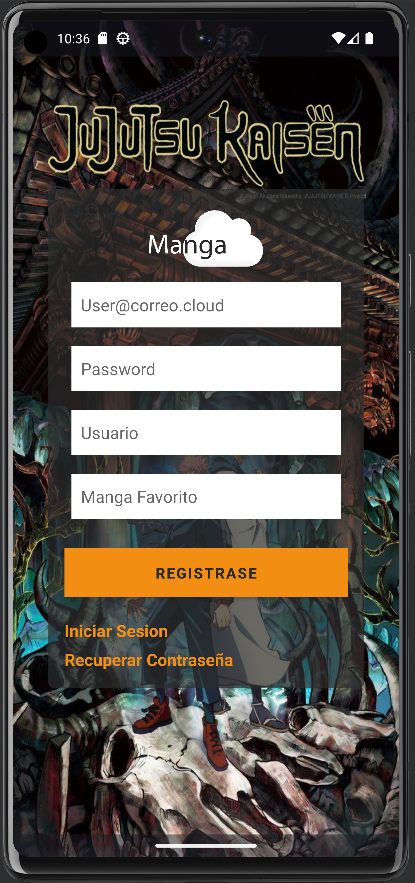
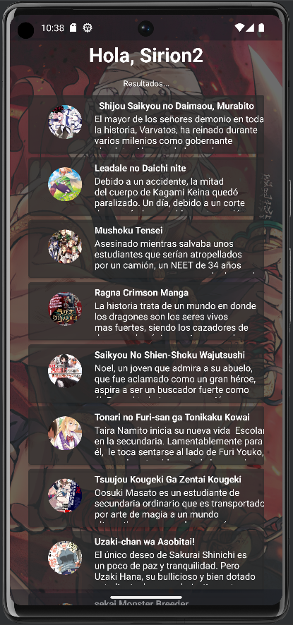
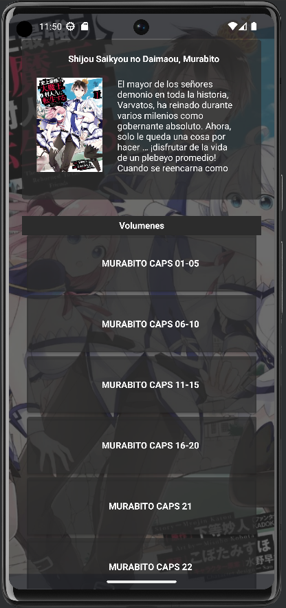
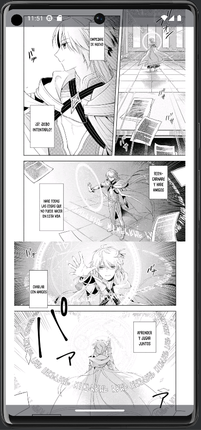
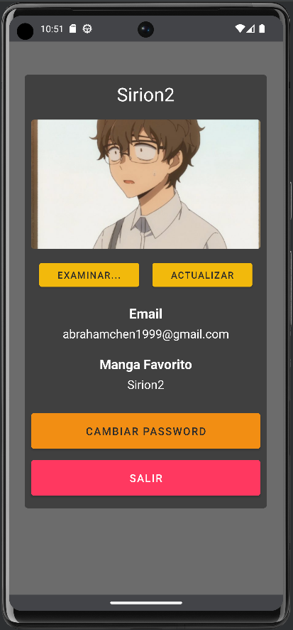
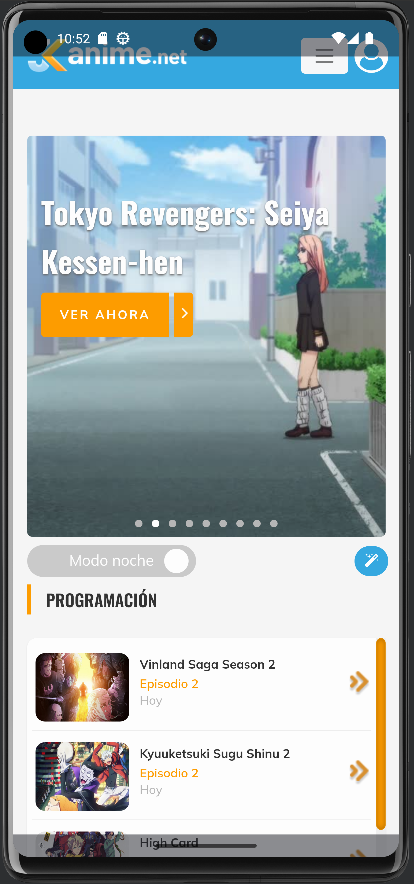
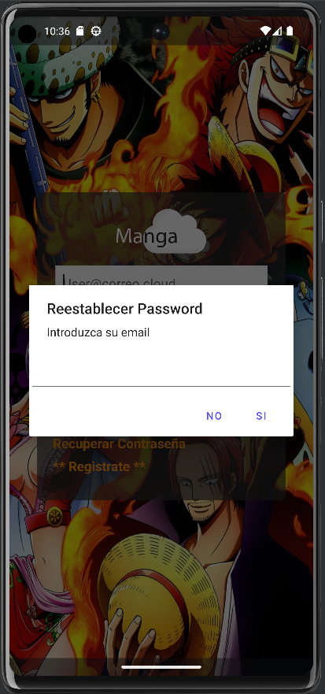
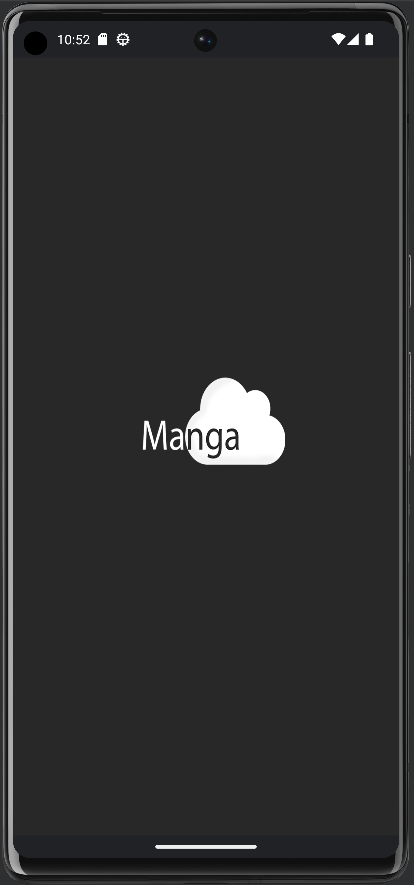
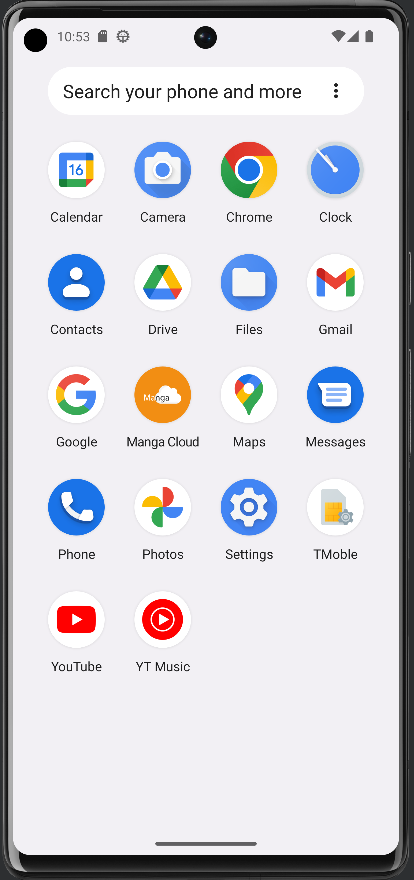
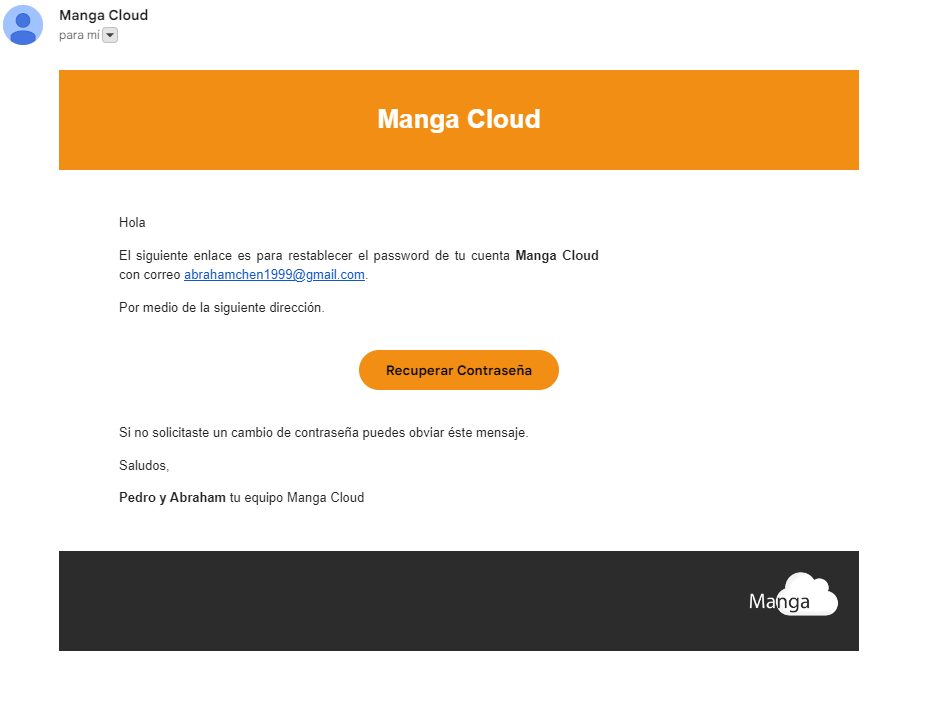

## Manga Cloud
Aplicación para la lectura de anime y manga.

## Herramientas Utilizadas:
- [x] Java.
- [x] Android Studio.
- [x] Google Firebase
- [x] Herramientas de Edición.

## Caracteristicas:
La plicación está desarrollada para se familia al usuario de manera inmediata, facilitando su uso , inclusive a personas no afines a dispositivos mobiles.

## Secciones:
 - Registro.
 - Login.
 - Cambiar Contraseña.
 - Leer Manga.
 - Acutalizar Perfil.
 - Ver Anime.

## Interfaz de Usuario:
La aplicación cuenta con als siguientes activides:

 1. **Registro:** Permite la inscripsión a la plataforma por primera vez.

    

 2. **Iniciar Sesion:** Permite al usuario previamente registrado acceder a la plataforma.

    

 3. **Menu Principal:** Una vez verificado permite la usuario acceder al contenido que incluye la plataforma.

    

 4. **Manga Seleccionado:** Al usuario selecciona un manga a leer del siguiente catalogo se desplegará la siguiente *Actividad* listando los volumenes que contiene:
 
    

 5. **Volumen Desplegado:** Muestra el volumen seleccionado en formato *.pdf* Al usuario y posee la caracteristica de optimización para la web que se traduce en menos ocnsumos de datos.

    

 6. **Perfil de Usuario:** Provee al usaurio la capacidad de adminsitrar su cuenta.

    

 7. **Ver Anime:** Da al usuario a acceder a la página web  de *JK anime* [página web]: https://jkanime.net/
 
    
 
 8. **Cambiar Contraseña** Permite al usuario introducir su correo electrónico el cual le enviará un enlace para realizar el cambio.

    

## Miscélaneos
 9. Pantalla de Carga:

    

 1. Vista en baul de aplicaciones:
    
    

 1. Notificación para cambio de contraseña:
 
    